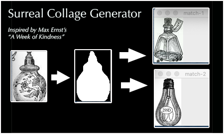
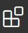
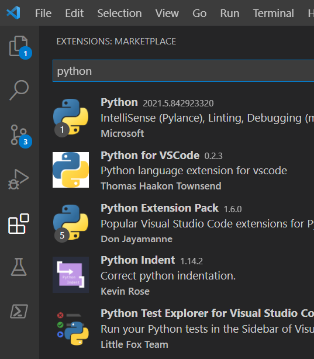
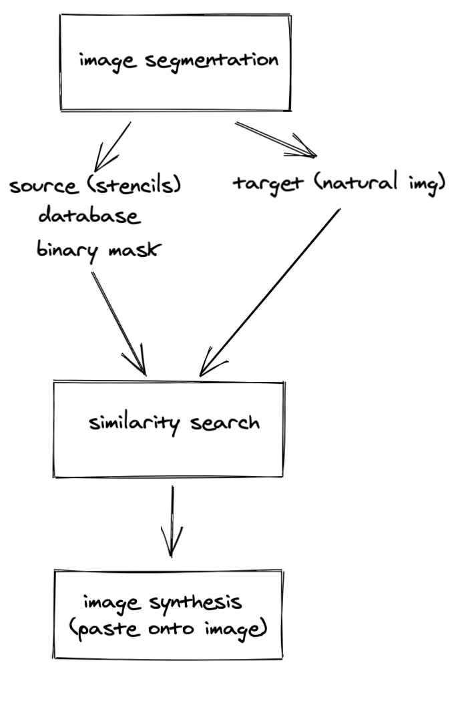
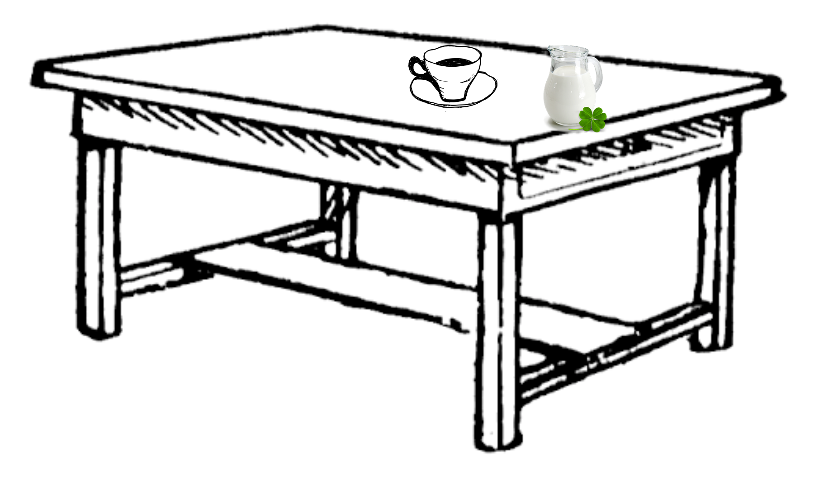

# Surreal Collage Generator
​
A system for generating collages inspired by Max Ernst's [A Week of Kindness](http://www.all-art.org/art_20th_century/ernst_Max1.html)



## How does it work?
​
This system takes two inputs:  
1. An individual or collection of "source images" that will be "cut-up" and become elements of our collages
2. An image to serve as a guide or "target image" that we will re-create using our elements taken from the source images
​
## Dependencies
​
The following packages are required to run the collage generating system:
numpy
scipy
Pillow
cython
matplotlib
scikit-image
torch==1.8
opencv-python
h5py
imgaug
IPython[all]
​
We will also need to run the following pip commands to install facebooks Detectron for segmentation:
​
```
!pip install pyyaml==5.1
!pip install torch==1.8.0+cu101 torchvision==0.9.0+cu101 -f https://download.pytorch.org/whl/torch_stable.html
!pip install detectron2 -f https://dl.fbaipublicfiles.com/detectron2/wheels/cu101/torch1.8/index.html
```
​
# Set up your environment
​
## Run the setup script
​
Based on your OS/Terminal combination, you need to add the following commands to initialize your terminal environment correctly. All the setup commands must be run from the repository root **every time you open a new terminal and `cd` into the repo directory**.  The first time you run this script it may take a while to install minconda, python, and any dependencies.  Subsequent runs of the script should be much faster.
​
If you already have [conda](https://docs.conda.io/en/latest/) installed on your machine, we use the already available conda to setup our virtual environment, otherwise, a conda is installed locally in the repository.
​
### Windows + Powershell
​
Powershell (not CMD) is recommended on Windows. We recomend using [Windows Terminal](https://www.microsoft.com/en-us/p/windows-terminal/9n0dx20hk701) which provides a nice developer experience that supports powershell and several quality-of-life features like tabs, sensible copy-paste, Unicode support, etc.  
​
```
& tools\setup.ps1
```
​
### Linux/MacOS + bash
​
Note that `zsh` is the default on MacOS these days.  We don't guarantee this will work with `zsh` but it is [pretty easy to switch to `bash`](https://www.howtogeek.com/444596/how-to-change-the-default-shell-to-bash-in-macos-catalina/).
​
```
source tools/setup.sh
```
​
## Python installation and system PATH
* You do not need python installed separately, the setup command took care of it for you (enter `which python` in your terminal to confirm that you are now using the python installed in this project's virtual environment).  You should see your project name listed as the active virtual environment in your terminal now, just before the prompt.
​
```
(thrall) $ 
```
​
* You do not need to add `sys.path.append` at the beginning of your python scripts, the setup commands will make sure that your package (`thrall` in our case) is available to your python.
​
## Download Visual Studio Code (vscode)
​
Visual Studio Code (hereinafter referred to as __vscode__) offers a very nice development experience with auto complete, linting and debugger integration. It is highly recommeded to use vscode for development. You can download vscode from here: https://code.visualstudio.com/download
​
Once downloaded, open the vscode app and take care of a few one-time setup steps.
​
1. Click the  button and type "python" into the search bar.  Install the "Python" extension. (first result)
​
   
​
2. (Mac-only) Press Ctrl+Shift+P, type "shell", and select the "Shell Command: Install 'code' command in PATH" entry.
3. Close VS Code.  We'll reopen it later from the terminal, with the `code` command.
​
# System implementation details
​
The system creates collages by performing two phases: separating source images and mapping them to the target image
​

​
## Separating source images
​
- Instance segmentation using [MaskRCNN](https://alittlepain833.medium.com/simple-understanding-of-mask-rcnn-134b5b330e95#:~:text=Mask%20RCNN%20is%20a%20deep,two%20stages%20of%20Mask%20RCNN.) approach on the source image dataset in order to identify the bounding box and convex hull of the shapes in the image. 
- Each resulting segmented image is then pixel-copied to a unique png file. Output from the system is an individual png file for each object intance identified inside the source image. 
​
## Composing the collage using target image
​
- Instance segmentation is also performed on the target image using [MaskRCNN](https://alittlepain833.medium.com/simple-understanding-of-mask-rcnn-134b5b330e95#:~:text=Mask%20RCNN%20is%20a%20deep,two%20stages%20of%20Mask%20RCNN.) which outputs the convex hull and bounding box location for each object identified in the target image. 
- Once this convex hull and bounding box has been identified, the convex hull of each object in the target image is compared with each image in the processed source image dataset using the [intersection over union](https://www.pyimagesearch.com/2016/11/07/intersection-over-union-iou-for-object-detection/) approach. This results in a list of 5 candidate objects in the source dataset that nearest resemble the shape of the given object in the target dataset. 
- From these 5 candidates, the optimal matching candidate from the source dataset is then pixel copied to the location of the bounding box for the object in the target dataset. 
- This proces is then repeated for each object identified in the target dataset until each object has been replaced with an object from the source dataset. 
​
Thus, the collage's composition is guided by the target image and composed of objects from the source image. 
​
# Current Issues
​
Most elements of the main pipeline are functional with a single break. The pasting function expects actual pngs and locations and bounding boxes in order to paste onto target png. However, the output of the 'queery' function produces tuples of [RGB, Alpha]. We were unable to convert these tuples into images that would be usable by the pasting function. Current state of the function outputs something similar to this: 
​

